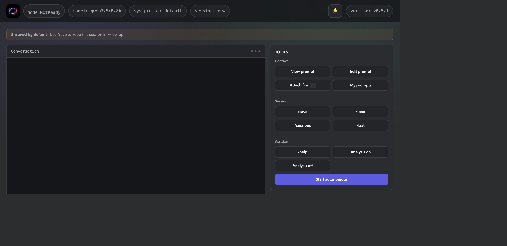

<div align="center">


[](https://github.com/michalswi/owrap)
[](https://github.com/michalswi/owrap)
[](https://github.com/michalswi/owrap/fork)


[](LICENSE)
[](#)
[](#)



</div>

# OWRAP

OWRAP is a lightweight Go CLI and web UI for an Ollama-compatible chat endpoint. It supports configurable system prompts, optional model reasoning, session save/load, model-requested local commands, file attachments, and a web-only autonomous agent.

OWRAP is local-first, but it is not an isolation boundary: configured Ollama endpoints and executed commands may access the network. It is available as source, a native binary, and the `michalsw/owrap:latest` Docker image.

## Requirements

- Go `1.25.5` or a downloaded OWRAP binary
- A running [Ollama](https://ollama.com/) server
- A local model, for example:

```sh
ollama serve
ollama pull qwen3.5:0.8b
```

Larger models generally perform better in autonomous mode.

## Configuration

| Variable | Default | Purpose |
|---|---|---|
| `OLLAMA_URL` | `http://localhost:11434/api/chat` | Ollama-compatible chat endpoint |
| `OLLAMA_MODEL` | `qwen3.5:0.8b` | Model used for requests |
| `SYSTEM_PROMPT` | built-in prompt | Path to the startup system-prompt file |
| `WEB_BIND` | `:8080` | Web server listen address |

## Build and Run

Build the current-platform binary:

```sh
make build
```

Keep the `prompts/` directory beside the binary; prompt files are runtime dependencies.

```sh
./owrap       # terminal mode
./owrap -web  # web UI at http://localhost:8080/
```

Example with custom settings:

```sh
OLLAMA_MODEL=gemma3:12b \
SYSTEM_PROMPT=./prompts/shell_command_assistant.txt \
WEB_BIND=127.0.0.1:8080 \
./owrap -web
```

Other targets include `make build-mac`, `make build-linux`, `make go-build`, and `make docker-build`.

Thinking is disabled at startup. Use `/think-on` and `/think-off`; supported models return reasoning separately, and the web UI displays it in a collapsed section.


## Docker

The image supports `linux/amd64` and `linux/arm64`. Ollama must be reachable from the container, so do not use container-local `localhost` for a host Ollama server.

```sh
docker run -d --rm \
  --name owrap \
  -e OLLAMA_URL="http://<ollama-host>:11434/api/chat" \
  -p 8080:8080 \
  michalsw/owrap:latest
```

Not every command listed in [comm.go](./comm.go) is installed in the image.

## Usage

Run `/h` in the terminal for the complete command list. Common controls are:

| Command | Purpose |
|---|---|
| `/save [NAME]`, `/load NAME`, `/sessions` | Save, restore, and list sessions |
| `/editsysprompt`, `/sysprompt` | Change or inspect the system prompt |
| `/think-on`, `/think-off` | Enable or disable model reasoning |
| `/auto-on`, `/auto-off` | Toggle automatic command-output analysis |
| `/stats`, `/last`, `/myprompts` | Inspect current session activity |
| `/p`, `/cache`, `/use` | Work with multiline cached input |
| `/execfile PATH` | Execute nonempty command lines from a file |

The web UI exposes equivalent controls where supported. Predefined roles are in [prompts/](./prompts/); custom `.txt` prompts can be added there.

Model-requested commands are checked against [comm.go](./comm.go), and stdout/stderr is returned to the model. This is not a security sandbox: shell-capable paths and the direct command API execute with the permissions of the OWRAP process.

## Sessions and Files

- Named sessions: `~/.owrap/sessions/`
- Active web state: `~/.owrap/web_state.json`
- Autonomous attachments: `~/.owrap/autonomous_files/<session-id>/`

Browser refreshes preserve the active web chat while OWRAP is running. Stopping and starting OWRAP creates a fresh chat and removes stale autonomous files. Use `/save` before restart and `/load` afterward to continue previous work.

## Autonomous Mode

Autonomous mode is a beta web-only workflow. Select `/autostart`, provide an objective plus optional expected output, constraints, completion criteria, and file attachment, then start the run. Starting autonomous mode resets the active system prompt to the built-in `default`; that prompt remains selected after the run ends.

The backend owns the execution loop. It can plan, run allowed tools, inspect observations, retry failed commands, ask clarification questions, and submit a candidate answer. A separate critic pass checks the answer against the goal and evidence. The user can provide revision feedback, accept the result, or stop with `/autostop`.

Runs are limited to 30 iterations and 30 minutes; model calls and foreground commands have two-minute deadlines. Browser refreshes do not interrupt a run, but restarting OWRAP clears it.

## Security and License

OWRAP has no authentication, TLS, CSRF protection, or command sandbox. Use it only in a trusted environment and only against systems you are authorized to access. You are responsible for commands and network activity initiated through the application.

Licensed under the [Apache License 2.0](LICENSE).
